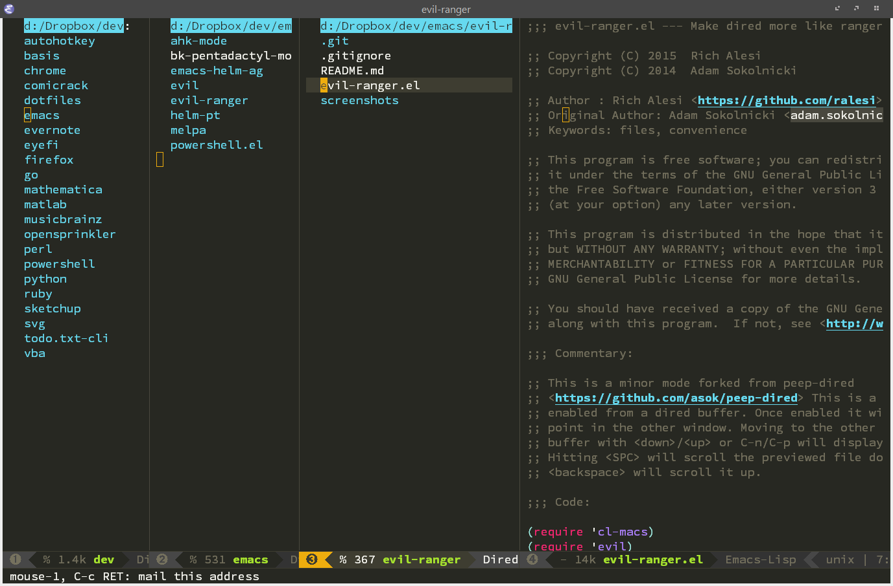

# Evil Ranger
[](http://melpa.org/#/evil-ranger)
<!-- markdown-toc start - Don't edit this section. Run M-x markdown-toc/generate-toc again -->
**Table of Contents**

- [Evil Ranger](#evil-ranger)
    - [Description](#description)
    - [Installation](#installation)
        - [Screenshot](#screenshot)
        - [Screencast](#screencast)
    - [Todo](#todo)
    - [Key bindings](#key-bindings)
    - [Configuration](#configuration)
        - [Customizing](#customizing)
        - [Ignoring Certain File Extensions During Preview](#ignoring-certain-file-extensions-during-preview)

<!-- markdown-toc end -->

## Description

This is a minor mode that runs within dired emulating many of the features of
ranger. This minor mode shows a stack of the parent directories and updates the
parent buffers while nvaigating the file system. The preview window takes some
of the ideas from [Peep-Dired][https://github.com/asok/peep-dired] to display
previews for selected files in the primary dired buffer.

## Installation

Once you have setup [Melpa](http://melpa.milkbox.net/#/getting-started) you can
use `package-install` command to install Evil Ranger. The package name is `evil-ranger`.

### Screenshot

evil-ranger mode active


evil-ranger mode with preview enabled


### Screencast

evil-ranger screencast


## Todo

* Create bindings to go up / down the next directory
* DONE: Log evil-ranger history and allow prompt to navigate back
* Add ranger style copy and pasted
* Improve headerline display
* Set up tabs and navigation between
* DONE: Improve sorting

## Key bindings

| Keybindings | Description                                 |
| ----------- | -------------------------------------- |
| `C-p`       | toggle evil-ranger in dired buffer          |
| `j`         | navigate down                               |
| `k`         | navigate up                                 |
| `C-j`       | scroll preview window down                  |
| `C-k`       | scroll preview window up                    |
| `f`         | search for file names                       |
| `i`         | show preview of current file                |
| `H`         | search through history                      |
| `zi`        | toggle showing literal / full-text previews |
| `zh`        | toggle showing dotfiles                     |
| `o`         | sort options                                |
| `h`         | go up directory                             |
| `l` / `RET` | find file / enter directory                 |
| `q`         | quit                                        |
| `r`         | revert buffer                               |
| `z-`        | reduce number of parents                    |
| `z+`        | increment number of parents                 |
| `v`         | toggle all marks                            |
| `V`         | visually select lines                       |
| `S`         | enter shell                                 |
| `C-SPC`     | mark current file                           |

## Configuration

Most parameters can be toggled on and off and stay within the current emacs
session. Any settings that are desired on startup should be set below. 

### Customizing

When disabling the mode you can choose to kill the buffers that were opened while browsing the directories.
```el
(setq evil-ranger-cleanup-on-disable t)
```

Or you can choose to kill the buffer just after you move to another entry in the dired buffer.
```el
(setq evil-ranger-cleanup-eagerly t)
```

You can choose to show dotfiles at ranger startup, toggled by `zh`
```el
(setq evil-ranger-show-dotfiles t)
```

Define custom function used to output header of primary evil-ranger window. Must
return a string that is placed in the header-line.
```el
(setq evil-ranger-header-func 'evil-ranger-header-line)
```

Define custom function used to output header of parent and preview windows. Must
return a string that is placed in the header-line.
```el
(setq evil-ranger-parent-header-func 'evil-ranger-parent-header-line)
```

### Parent options

You can set the number of folders to nest to the left, adjusted by `z-` and `z+`
```el
(setq evil-ranger-parent-depth 2)
```

You can set the size of the parent windows as a fraction of the frame size
```el
(setq evil-ranger-width-parents 0.12)
```

When increasing number of nested parent folders, set max width as fraction of
frame size to prevent filling up entire frame with parents.
```el
(setq evil-ranger-max-parent-width 0.12)
```

### Preview options

You can choose to show previews literally, or through find-file, toggled by `zi`
```el
(setq evil-ranger-show-dotfiles t)
```

You can set the size of the preview windows as a fraction of the frame size
```el
(setq evil-ranger-width-preview 0.55)
```

You probably don't want to open certain files like videos when using Peep Dired. To ignore certain files when moving over them you can customize the following to your liking:

```el
(setq evil-ranger-ignored-extensions '("mkv" "iso" "mp4"))
```

To set the max files size (in MB), set the following parameter:

```el
(setq evil-ranger-max-preview-size 10)
```
